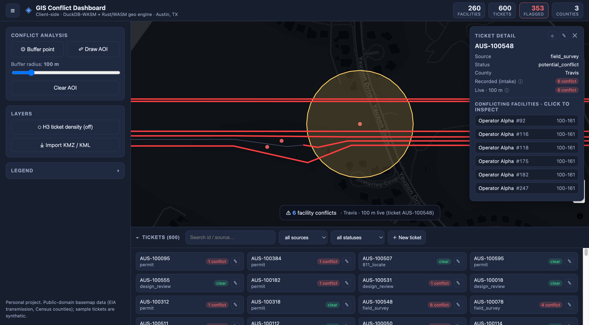

# GIS Conflict Dashboard

**▶ [Live demo](https://the-snowmen.github.io/GIS-Conflict-Dashboard/)**

A **fully static, client-side** GIS conflict-analysis dashboard: does a proposed work area conflict
with existing utility infrastructure, and which jurisdiction is it in? Everything — tabular and spatial
SQL, precision geometry, and the map — runs in the browser. No backend, no database server, so it
hosts on GitHub Pages.

> **Note.** A personal project. The basemap layers are public-domain (EIA transmission lines, Census
> counties); the tickets and areas of interest are **synthetic**, generated by the build script — see
> [`DATA_SOURCES.md`](DATA_SOURCES.md).

[](https://the-snowmen.github.io/GIS-Conflict-Dashboard/)

## What it does

- **Conflict analysis** — drop a work point (geodesic meter buffer) or draw an AOI polygon; see the
  intersecting facilities (`ST_Intersects`) and containing county (`ST_Within`) computed live, with an
  adjustable buffer radius.
- **Ticket records** — a searchable, filterable dock of work tickets; click one to fly to it and
  inspect its conflicts; create / edit / delete tickets, with each ticket's status auto-derived from
  its live conflict count.
- **Click-to-inspect** — click any facility, ticket, or hex to read its attributes; hovering a
  conflicting facility flashes it on the map, and the detail panel re-centers on demand.
- **H3 density heatmap** — multi-resolution hex binning of ticket density.
- **KMZ / KML import** — drop a KMZ/KML file and it's parsed in-browser to GeoJSON and overlaid.

The split: tabular + spatial **queries** run in DuckDB-WASM, **precision geometry** in a custom
Rust→WebAssembly engine, and rendering in MapLibre GL.

## Architecture

Two engines run in the browser, splitting query work from precision geometry the way a PostGIS
backend and a thin client would:

| Concern | Engine |
|---|---|
| Tabular + spatial **queries** — ticket/facility search, stats, AOI↔facility conflict join (`ST_Intersects`), jurisdiction point-in-polygon (`ST_Within`), envelopes | **DuckDB-WASM** + Spatial, querying the GeoParquet assets over HTTP range reads |
| **Precision geometry** — geodesic buffering in meters (parity with PostGIS `::geography`), H3 multi-resolution indexing + hex density, KMZ/KML parsing | **`geokit`**, a custom Rust → WebAssembly engine (this repo) |

Conflict gating is a generic, **config-driven** owner/status rule
([`data/demo_config.json`](data/demo_config.json)) applied as a SQL `WHERE`.

## Repository layout

```
packages/geo-engine/     # `geokit` — Rust→WASM geo engine (buffer / H3 / KMZ)
  src/core/              #   pure-Rust logic (native unit + golden tests, criterion benches)
  src/wasm.rs            #   wasm-bindgen shims (compiled only for wasm32)
scripts/build_demo_db.py # downloads public data + fabricates tickets → GeoParquet
apps/web/                # Vite + React + TypeScript app (map + DuckDB/geokit query layer)
apps/web/public/data/    # committed GeoParquet assets (facility/ticket/aoi/county)
data/demo_config.json    # generic conflict rule (owner/status gating)
```

## The `geokit` geo engine

Built on mature, pure-Rust crates (no C deps → clean wasm build): `geo` (planar buffer),
`proj4rs` (WGS84↔UTM), `geographiclib-rs` (geodesic circles), `h3o` (H3), `zip`+`kml`+`geojson` (KMZ).

```bash
# native tests (units + golden parity vs PostGIS-geography / the H3 reference)
cargo test -p geokit
# criterion benchmarks
cargo bench -p geokit
# build the npm-importable WASM package (-> packages/geo-engine/pkg)
wasm-pack build packages/geo-engine --target bundler --out-name geokit
```

WASM API (TypeScript surface): `buffer_geojson`, `h3_index_point`, `h3_multi_res`,
`h3_cell_boundary_geojson`, `h3_hex_density_geojson`, `h3_polyfill`, `kmz_to_geojson`.

## Building the demo data

```bash
pip install duckdb h3 requests
python scripts/build_demo_db.py --metro austin   # Austin, TX (Travis/Williamson/Hays)
```

This writes ~0.5 MB of GeoParquet to `apps/web/public/data/`. Region is configurable via `--metro`.

## Running the web app locally

```bash
wasm-pack build packages/geo-engine --target bundler --out-name geokit   # build geokit WASM
cd apps/web && npm install && npm run dev                                 # http://localhost:5173
```

`npm run build` produces a static bundle in `apps/web/dist`; `npm run preview` serves it at the
GitHub-Pages base path. DuckDB-WASM and its spatial extension load from the jsDelivr / DuckDB
extension CDNs at runtime — the only network dependency; everything else is static.

## Status

- ✅ `geokit` Rust→WASM engine (buffer, H3, KMZ) with tests + benches + wasm build
- ✅ Public-data + synthetic-ticket build pipeline → GeoParquet
- ✅ DuckDB-WASM query layer + React/MapLibre dashboard (conflict analysis, ticket CRUD, H3, KMZ)
- ✅ Deployed to GitHub Pages → **[live demo](https://the-snowmen.github.io/GIS-Conflict-Dashboard/)**

## License

[MIT](LICENSE). Data is public-domain or fabricated — see [`DATA_SOURCES.md`](DATA_SOURCES.md).
