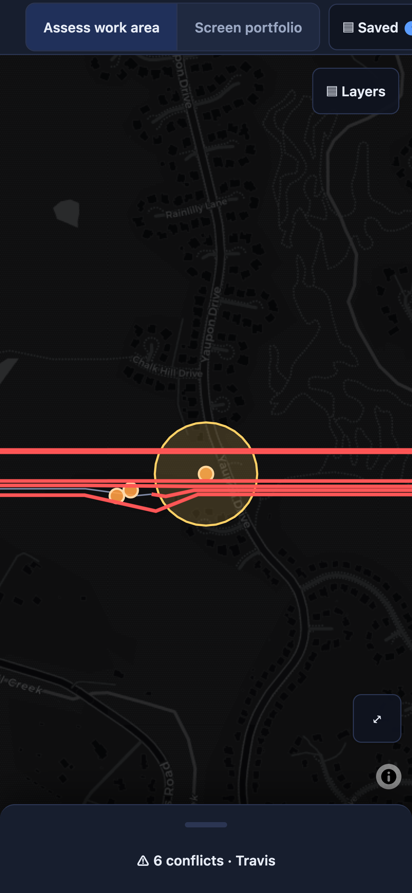

# GIS Conflict Dashboard

[](packages/geo-engine)
[](apps/web)
[](https://duckdb.org/docs/api/wasm/overview.html)
[](https://maplibre.org/)
[](https://webassembly.org/)
[](LICENSE)
[](https://the-snowmen.github.io/GIS-Conflict-Dashboard/)

**Does a proposed work area conflict with existing utility infrastructure — and which jurisdiction is
it in?** A **fully static, client-side** GIS conflict-analysis dashboard: tabular and spatial SQL,
precision geometry, and the map all run in the browser. No backend, no database server — so it hosts
as a static site on GitHub Pages.

**▶ [Live demo](https://the-snowmen.github.io/GIS-Conflict-Dashboard/)**

[](https://the-snowmen.github.io/GIS-Conflict-Dashboard/)

> **Note.** A personal project. The basemap layers are public-domain (EIA transmission lines, Census
> counties); the tickets and areas of interest are **synthetic**, generated by the build script — see
> [`DATA_SOURCES.md`](DATA_SOURCES.md).

## What it does

The workspace has two modes, one per decision.

**Assess work area** — does this specific job conflict?

- **Define the area** — pick an existing ticket, click a point on the map, draw a polygon, type
  coordinates, or import a KML/KMZ/GeoJSON feature. Points get a geodesic meter buffer; the AOI previews
  on the map as you adjust the distance.
- **Configure the rule** — an editable owner/status rule with one-click presets sets what counts as a
  conflict, summarized in a plain-language sentence ("counts in service and planned facilities owned by
  Operator Alpha, excluding retired"). Changing it recolors the network and updates the flagged tally
  across the dataset.
- **Run it** — the analysis is an explicit step, so results always state the configuration that produced
  them; changing the distance or rule afterwards marks them out of date until you re-run.
- **Review the evidence** — intersecting facilities (`ST_Intersects`) and the containing county
  (`ST_Within`), presented as a summary verdict, a sortable facility table ranked nearest-first, and a
  printable report. Selecting a row locates the facility on the map and opens its full attributes;
  clicking the map selects the row.

**Screen portfolio** — which areas deserve attention first?

- A tunable **conflict-index** choropleth over H3 hexes: a weighted, normalized score per cell (ticket
  volume, conflict rate, mean severity, facility density) with hotspot outlining. Named scoring presets
  come first; resolution, weights, normalization, and threshold sit behind an advanced disclosure.
  Selecting a ranked cell locates it, breaks down its metrics, lists its tickets, and hands off into a
  work-area assessment.

**Throughout**

- **Click-to-inspect** — click any facility, ticket, or hex to read its attributes; hovering a
  conflicting facility flashes it on the map.
- **Ticket evidence** — searchable, filterable work tickets with independent work type, priority, and
  workflow state; browser-local scenario edits stay clearly separate from the shipped sample.
- **Saved analyses** — name and annotate a run, then store it in IndexedDB and reopen it later with its
  geometry, rule, layers, and results intact. A portable JSON project exports and reopens the same state
  as a file — still no backend.
- **Export** — the report prints to PDF; the analysis also exports as CSV, GeoJSON, and a styled **KMZ**
  with AOI/conflict folders, legend text, and the exact rule assumptions.

## How it's built

DuckDB-WASM and a Rust→WebAssembly geometry module run in the browser, splitting query work from
precision geometry the way a PostGIS backend and a thin client would — but with no server:

| Concern | Component |
|---|---|
| Tabular + spatial **queries** — ticket/facility search, stats, AOI↔facility conflict join (`ST_Intersects`), jurisdiction point-in-polygon (`ST_Within`), envelopes | **DuckDB-WASM** + Spatial, querying the GeoParquet assets over HTTP range reads |
| **Precision geometry** — geodesic meter buffering (ellipsoidal circles via `geographiclib-rs`; lines/polygons via a UTM planar buffer), H3 multi-resolution indexing + hex density, KMZ/KML parsing | **`geokit`**, a Rust → WebAssembly module (this repo) |
| **Rendering + interaction** — vector map, layer styling, hover/click picking, the workspace layout | **MapLibre GL** + React + TypeScript |

The map is the workspace. A single task panel carries the mode's steps, results open in a resizable
bottom tray, layers and the legend live in a map popover, and feature detail opens in a contextual
drawer — with keyboard shortcuts on desktop, collapsing to a draggable bottom sheet on phones that
follows the same setup/results model. Conflict gating is a
generic, **config-driven** owner/status rule ([`data/demo_config.json`](data/demo_config.json)) applied
as a SQL `WHERE`.

## Screenshots

Two H3 hex layers — a weighted conflict-index screening score and a raw ticket-density heatmap:

| H3 conflict-index cells | H3 ticket-density heatmap |
|---|---|
| [](https://the-snowmen.github.io/GIS-Conflict-Dashboard/) | [](https://the-snowmen.github.io/GIS-Conflict-Dashboard/) |
| A tunable weighted score per hex — ticket volume, conflict rate, mean severity, facility density; hotspots outlined, click to drill into a cell's tickets. | Where work clusters, binned into H3 hexes. |

Every run itemizes its evidence — the conflicting facilities ranked nearest-first; clicking one (in the
table or on the map) opens its detail drawer. On phones the workspace collapses to a draggable bottom
sheet whose collapsed state keeps a one-line verdict over the full-bleed map:

| Facility detail drawer | Mobile bottom-sheet |
|---|---|
|  |  |

## Quickstart

```bash
# 1. Build the geokit WASM package (needed by the web app)
wasm-pack build packages/geo-engine --target bundler --out-name geokit

# 2. (Optional) rebuild the demo data — Austin, TX by default; --metro to change region
pip install duckdb h3 requests
python scripts/build_demo_db.py --metro austin        # writes ~0.5 MB of GeoParquet to apps/web/public/data/

# 3. Run the web app
cd apps/web && npm install && npm run dev              # http://localhost:5173
```

`npm run build` produces a static bundle in `apps/web/dist`; `npm run preview` serves it at the
GitHub-Pages base path. DuckDB-WASM and its spatial extension load from the jsDelivr / DuckDB extension
CDNs at runtime — the only network dependency; everything else is static.

## The `geokit` module

A Rust→WebAssembly geometry module built on mature, pure-Rust crates (no C deps → clean wasm build):
`geo` (planar buffer), `proj4rs` (WGS84↔UTM), `geographiclib-rs` (geodesic circles), `h3o` (H3),
`zip`+`kml`+`geojson` (KMZ).

```bash
cargo test  -p geokit    # native: geodesic buffer area/shape sanity checks + H3 indices vs the reference cell
cargo bench -p geokit    # criterion benchmarks
wasm-pack build packages/geo-engine --target bundler --out-name geokit   # -> packages/geo-engine/pkg
```

WASM API (TypeScript surface): `buffer_geojson`, `h3_index_point`, `h3_multi_res`,
`h3_cell_boundary_geojson`, `h3_hex_density_geojson`, `h3_polyfill`, `kmz_to_geojson`.

## Repository layout

```
packages/geo-engine/     # `geokit` — Rust→WASM geometry module (buffer / H3 / KMZ)
  src/core/              #   pure-Rust logic (native unit + golden tests, criterion benches)
  src/wasm.rs            #   wasm-bindgen shims (compiled only for wasm32)
scripts/build_demo_db.py # downloads public data + fabricates tickets → GeoParquet
scripts/record_demo.mjs  # captures the demo walkthrough over CDP; make_demo_gif.sh renders docs/demo.gif
apps/web/                # Vite + React + TypeScript app (map + DuckDB/geokit query layer)
apps/web/public/data/    # committed GeoParquet assets (facility/ticket/aoi/county)
data/demo_config.json    # generic conflict rule (owner/status gating)
```

## Status

Deployed to GitHub Pages → **[live demo](https://the-snowmen.github.io/GIS-Conflict-Dashboard/)**. The
`geokit` module (buffer / H3 / KMZ, with native tests + benches), the public-data + synthetic-ticket
build pipeline, and the DuckDB-WASM query layer + React/MapLibre dashboard are all in place — the
assess-work-area and screen-portfolio workflows, the live conflict rule, ticket CRUD, H3 density +
conflict-index, KMZ/KML import, saved analyses and portable projects, report/CSV/GeoJSON/KMZ export, and
a responsive layout with a mobile bottom sheet.

## License

[MIT](LICENSE). Data is public-domain or fabricated — see [`DATA_SOURCES.md`](DATA_SOURCES.md).
